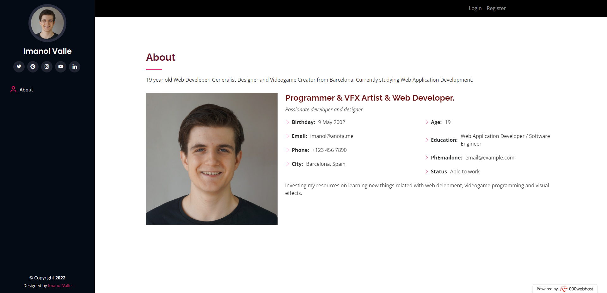
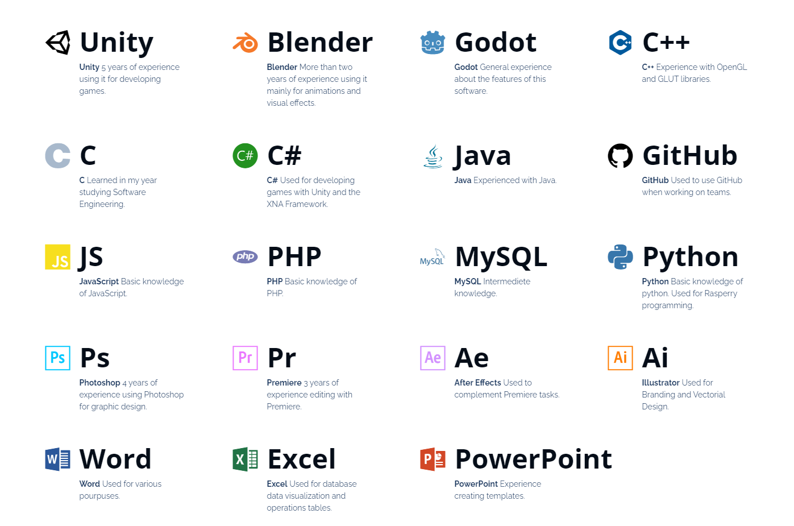

# Valle-Usabilitat-Dossier

## Análisis prévio

Según la página [https://desarrolloweb.com/](https://desarrolloweb.com/articulos/1133.php) el diseño de los sitios web debe seguir los siguientes principios.

### 1. Anticipación, el sitio web debe anticiparse a las debe anticiparse a las necesidades del usuario.

En su estado actual, mi página no cumple con esta regla. La página no ha sido diseñada inicialmente para satisfacer las necesidades de algunas personas.

### 2. Autonomía, los usuarios deben tener el control sobre el sitio web. Los usuarios sienten que controlan un sitio web si conocen su situación en un entorno abarcable y no infinito.

Al tener un menú de navegación, los usuarios pueden saber el tamaño de la página y los apartados que tiene.

### 3. Los colores han de utilizarse con precaución para no dificultar el acceso a los usuarios con problemas de distinción de colores (aprox. un 15% del total).

He comprobado el contraste entre colores usando las herramientas que me ha proporcionado el buscador google chrome. Mi contraste mínimo es del 12%, pero google lo señala como válido.

### 4. Consistencia, las aplicaciones deben ser consistentes con las expectativas de los usuarios, es decir, con su aprendizaje previo.

Hay una inconsistencia en mi página que fue implementada adrede para facilitar que los usuarios encuentren el botón de iniciar sesión y registrarse. Estas dos opciones no se muestran en el menú de navegación lateral, si no que se muestran en un menú superior diferenciado. Esto es así para que los usuarios diferencien el comportamiento de navegación del de registro.

### 5. Eficiencia del usuario, los sitios web se deben centrar en la productividad del usuario, no en la del propio sitio web. Por ejemplo, en ocasiones tareas con mayor número de pasos son más rápidas de realizar para una persona que otras tareas con menos pasos, pero más complejas.

El sitio solo tiene la función de registrarse, iniciar sesión y, una vez dentro, salir, por lo tanto no hay mucho márgen para hacerlo más eficiente. 

### 6. Reversibilidad, un sitio web ha de permitir deshacer las acciones realizadas

Una vez el usuario ha inciado sesión puede cerrarla. También tiene una flecha para subir a la parte superior de la página una vez haya comenzado a bajar.

### 7. Ley de Fitts indica que el tiempo para alcanzar un objetivo con el ratón esta en función de la distancia y el tamaño del objetivo. A menor distancia y mayor tamaño más fácilidad para usar un mecanismo de interacción.

La interfaz de mi web se ve así:

Al entrar, los únicos botones son los de Login y Register, grandes, situados en la parte superior derecha de la pantalla. Son facilmente identificables. 

### 8. Reducción del tiempo de latencia. Hace posible optimizar el tiempo de espera del usuario, permitiendo la realización de otras tareas mientras se completa la previa e informando al usuario del tiempo pendiente para la finalización de la tarea.

No hay tiempo de latencia.

### 9. Aprendizaje, los sitios web deben requerir un mínimo proceso de aprendizaje y deben poder ser utilizados desde el primer momento.

El sitio web es demasiado simple para evaluar el aprendizaje.

### 10. El uso adecuado de metáforas facilita el aprendizaje de un sitio web, pero un uso inadecuado de estas puede dificultar enormemente el aprendizaje.

Los íconos de la página representan sus correspondientes apartados y referencias.

### 11. La protección del trabajo de los usuarios es prioritario, se debe asegurar que los usuarios nunca pierden su trabajo como consecuencia de un error.

Los usuario no pueden usar la web como herramienta y, por lo tanto, no pueden perder su trabajo.

### 12. Legibilidad, el color de los textos debe contrastar con el del fondo, y el tamaño de fuente debe ser suficientemente grande.

Los textos son légibles para la mayoría de personas y el contraste es adecuado.

### 13. Seguimiento de las acciones del usuario. Conociendo y almacenando información sobre su comportamiento previo se ha de permitir al usuario realizar operaciones frecuentes de manera más rápida.

No se puede aplicar a mi sitio web

### 14. Interfaz visible. Se deben evitar elementos invisibles de navegación que han de ser inferidos por los usuarios, menús desplegables, indicaciones ocultas, etc.

El menú se vuelve desplegable en dispositivos móviles para ahorrar espacio en pantalla. Esto se podría solventar cambiando la disposición de la página.

## Acciones de mejora

### Mejora 1: 
Siguiendo el punto 1, mejorar la web para que pueda satisfacer los problemas de las personas con necesidades especiales
### Mejora 2: 
Siguiendo el punto 4, mejorar la web para introducir los botones del menú superior en el menú lateral.
### Mejora 3: 
Siguiendo el punto 12, añadir un modo de alto contraste y alguna forma de aumentar el tamaño de la fuente.
### Mejora 4: 
Siguiendo el punto 14, buscar alguna alternativa al menu desplegable para móviles o señalar su existéncia mejor.

## Explicación de las mejoras

### Mejora 1: Siguiendo el punto 1, mejorar la web para que pueda satisfacer los problemas de las personas con necesidades especiales

1. Proporcionar descripciones alternativas: Agregar descripciones alternativas a imágenes y videos puede ayudar a las personas con discapacidades visuales a comprender mejor el contenido.

2. Hacer que el contenido sea compatible con lectores de pantalla: Asegurarse de que el contenido se presenta de manera clara y estructurada para que los lectores de pantalla puedan leerlo fácilmente.

3. Permitir la personalización: Proporcionar opciones para cambiar el tamaño de la fuente, el contraste y otros elementos de la página para adaptarse a las necesidades individuales de los usuarios.

4. Hacer que la navegación sea intuitiva: Asegurarse de que la navegación sea intuitiva y fácil de usar para todos los usuarios, incluyendo aquellos con discapacidades motoras o cognitivas.

### Mejora 2: Siguiendo el punto 4, mejorar la web para introducir los botones del menú superior en el menú lateral

Para mejorar la consisténcia de los menús, los botones de login y register se moverán al menú lateral y se aumentará el tamaño por defecto de la fuente del menú lateral para hacer más accesible la lectura de los textos.

### Mejora 3: Siguiendo el punto 12, añadir un modo de alto contraste y alguna forma de aumentar el tamaño de la fuente.

Debe haber un botón para habilitar el modo de alto contraste en la web. Este modo pondrá la página en modo noche y usará el blanco y el negro para todo. 

### Mejora 4: Siguiendo el punto 14, buscar alguna alternativa al menu desplegable para móviles o señalar su existéncia mejor.

Actualmente el menú desplegable se abre desde el botón rosado de arriba a la derecha: 

La idea es hacer el icono más grande y añadir un texto para que los usuarios entiendan que han de pulsar ahí.

## Conclusiones

Siendo el público de mi dosier una empresa que esté viendo mi curriculum, hacer una web accesible no solo es una cuestión de responsabilidad social, sino que también puede tener un impacto positivo la imágen del sitio.

Además, con la creciente importancia de la accesibilidad y la regulación gubernamental sobre la accesibilidad en la web, una web accesible puede ser un factor crítico para cumplir con las normas legales y evitar posibles demandas.

En cuanto a las mejoras realizadas, podemos enumerar las siguientes:

1. En los textos alternativos, títulos y navegación web.
2. En la unificación de los menús.
3. En la personalización de la apariencia de la web.
4. En la accesibilidad del menú desplegable.

